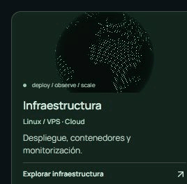
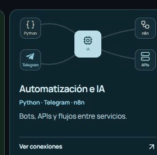
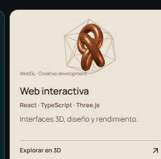

# Pablo Sánchez

### Desarrollo experiencias digitales y sistemas inteligentes que conectan diseño, software y automatización.

 

  <a href="https://github.com/pablo2611?tab=overview"><picture>
    <source media="(max-width: 900px)" srcset="https://raw.githubusercontent.com/pablo2611/pablo2611/main/assets/activity-heatmap-mobile.svg?v=1791668640104" />
    
  </picture></a>

 

## Especialidades

  <a href="https://pablo2611.github.io/pablo2611/#infraestructura"><picture><source media="(prefers-reduced-motion: reduce)" srcset="assets/expertise-infrastructure-poster.png" /></picture></a>
  <a href="https://pablo2611.github.io/pablo2611/#automatizacion"><picture><source media="(prefers-reduced-motion: reduce)" srcset="assets/expertise-automation-poster.png" /></picture></a>
  <a href="https://pablo2611.github.io/pablo2611/#web"><picture><source media="(prefers-reduced-motion: reduce)" srcset="assets/expertise-web-poster.png" /></picture></a>

<a href="https://pablo2611.github.io/pablo2611/">Explorar la versión interactiva ↗</a>

Ver habilidades técnicas

| Área | Enfoque |
| --- | --- |
| **Linux / VPS** | SSH, Docker, Nginx; despliegue, logs y monitorización. |
| **Python** | Backends asíncronos, tareas, colas y procesos persistentes. |
| **Telegram bots** | Bot API, webhooks, conversaciones, comandos y notificaciones. |
| **APIs de IA** | Contexto, herramientas e integración con servicios externos. |
| **Flujos / n8n** | Eventos, webhooks y automatización entre aplicaciones. |
| **Web interactiva** | React, TypeScript y Three.js; diseño, movimiento y rendimiento. |

 

## Experiencias interactivas

  
  

  <a href="https://pablo2611.github.io/aerion/">Conducir AERION ↗</a> · <a href="https://github.com/pablo2611/aerion">Código de AERION</a> 
  <a href="https://pablo2611.github.io/otro-plano/">Explorar Otro Plano ↗</a> · <a href="https://github.com/pablo2611/otro-plano">Código de Otro Plano</a>

---

**Desde Panamá.** Disponible para construir herramientas, bots e integraciones útiles.

  Actividad real obtenida de GitHub. La tarjeta se actualiza cada seis horas; GitHub puede tardar en contabilizar los commits recientes.

