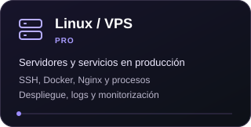
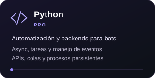
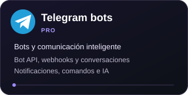
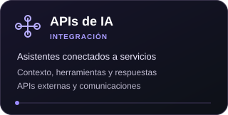
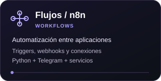
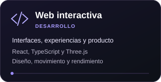

# Pablo Sánchez

### Desarrollo experiencias digitales y sistemas inteligentes que conectan diseño, software y automatización.

 

  <a href="https://github.com/pablo2611?tab=overview"><picture>
    <source media="(max-width: 900px)" srcset="https://raw.githubusercontent.com/pablo2611/pablo2611/main/assets/activity-heatmap-mobile.svg?v=1791439436849" />
    
  </picture></a>

 

## Habilidades y enfoque profesional

  <picture>
    <source media="(max-width: 900px)" srcset="https://raw.githubusercontent.com/pablo2611/pablo2611/main/assets/skills-rings-mobile.svg" />
    
  </picture>

### Bots, servidores e integraciones

  
  
  
  
  
  

**Mi enfoque:** sistemas que conectan un bot de Telegram con Python, APIs de IA y servicios externos; flujos de eventos y webhooks tipo n8n, desplegados y mantenidos en servidores Linux/VPS.

 

## Experiencias interactivas

  
  

  <a href="https://pablo2611.github.io/aerion/">Conducir AERION ↗</a> · <a href="https://github.com/pablo2611/aerion">Código de AERION</a> 
  <a href="https://pablo2611.github.io/otro-plano/">Explorar Otro Plano ↗</a> · <a href="https://github.com/pablo2611/otro-plano">Código de Otro Plano</a>

---

## Qué construyo

- **Bots y comunicaciones:** comandos, conversaciones, notificaciones y conexiones entre Telegram y servicios externos.
- **Python + IA:** backends asíncronos, contexto, herramientas, integración de APIs y automatizaciones.
- **Servidores y VPS:** despliegue, procesos persistentes, contenedores, proxy, registros y monitorización.
- **Flujos de trabajo:** triggers, webhooks y automatización entre aplicaciones con herramientas tipo n8n.

**Proyecto destacado:** [serverdock](https://github.com/pablo2611/serverdock), un panel bilingüe para gestionar servidores Linux VPS.

**Desde Panamá.** Disponible para construir herramientas, bots e integraciones útiles.

  Actividad real obtenida de GitHub. La tarjeta se actualiza cada seis horas; GitHub puede tardar en contabilizar los commits recientes.

